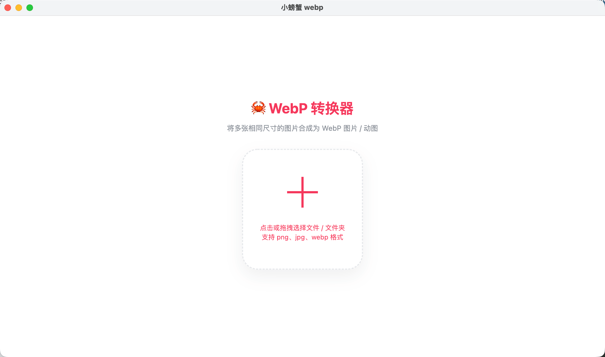
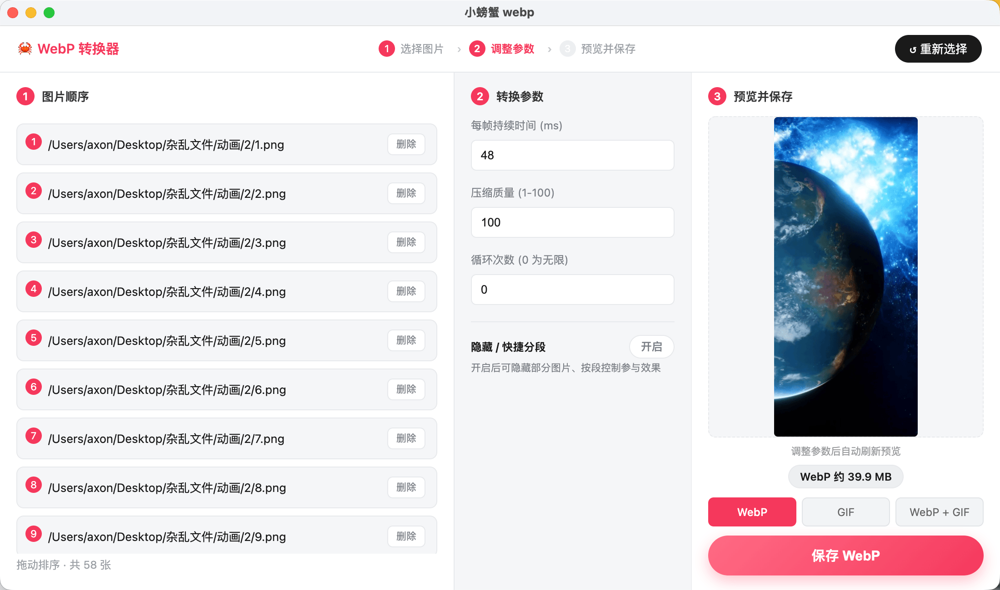

# 🦀 Crab WebP

> 一个无依赖、稳定、美观、易用的 WebP 动图生成器，解决其他工具生成的 WebP 在安卓、iOS、Web 等不同平台表现不一的问题。

[](LICENSE)
[](#下载)
[](#贡献)

## 简介

你可能遇到过用其他工具生成的 WebP 文件在安卓、iOS、Web 等不同平台上表现不同的问题。Crab WebP 通过内置官方 `img2webp` 工具以参数化方式调用，无需安装任何额外依赖，生成结果在各平台表现一致。

支持将多张相同尺寸的图片（PNG / JPG / WEBP）合成为动态 WebP，同时可一键导出 GIF。

## 截图

<p align="center">
    
</p>

<p align="center">
    
</p>

## 功能特性

- **拖拽排序** — 拖动图片自由调整帧顺序
- **参数调节** — 自定义每帧持续时间、压缩质量（1-100）、循环次数（0 为无限）
- **隐藏 / 快捷分段** — 可单独隐藏图片，或按位置分成 N 段，选择「仅显示该段」或「隐藏该段」，不删除原图
- **反选 / 全部显示** — 一键反选或恢复全部图片参与
- **实时预览** — 调整参数后自动刷新预览，所见即所得
- **多格式导出** — 支持 WebP、GIF，或同时导出两者
- **体积估算** — 实时显示 WebP 与 GIF 的预估体积
- **跨平台** — 支持 macOS 与 Windows
- **零依赖** — 内置 `img2webp` 二进制，无需安装任何外部工具，路径含空格也能正常工作

## 下载

前往 [Releases](https://github.com/nervouelf/webp-crab/releases) 下载最新版本：

| 平台 | 格式 | 说明 |
|------|------|------|
| macOS | `.dmg` | Apple Silicon (arm64) |
| Windows | `.exe` / `.zip` | NSIS 安装包 / 免安装版 |

## 使用说明

### macOS

如遇「未知开发者」提示，请前往 **系统偏好设置 → 安全性与隐私 → 通用**，点击「仍要打开」。

或在终端执行以下命令，并在 **系统偏好设置 → 安全性与隐私 → 通用** 中选择「任何来源」：

```bash
sudo spctl --master-disable
```

### Windows

下载 `.exe` 安装包运行即可；也可下载 `.zip` 免安装版直接运行。路径包含空格也能正常工作。

### 基本操作

1. 点击或拖拽选择图片 / 文件夹（支持 PNG、JPG、WEBP）
2. 拖动调整图片顺序，按需隐藏或分段
3. 设置每帧时长、质量、循环次数
4. 预览效果后，选择导出格式（WebP / GIF / 两者）并保存

## 本地开发

环境要求：[Node.js](https://nodejs.org/) 16+

```bash
# 安装依赖
npm install

# 启动开发模式
npm start
```

## 构建打包

### macOS（本地构建）

双击项目根目录的 `build_mac.command` 即可自动完成构建，或在终端执行：

```bash
npm run build:mac
```

构建脚本会自动检测签名证书与公证凭据，未配置时将进行无签名构建。

### Windows（GitHub Actions 自动构建）

Windows 版本通过 GitHub Actions 自动构建。推送 `v*` 格式的 Tag 即可触发：

```bash
git tag v1.0.0
git push origin v1.0.0
```

构建完成后，安装包会自动上传到对应的 Release。也可在仓库 **Actions** 页面手动触发构建。

> 如需本地构建 Windows 版本，可执行 `npm run build:win`（需在 Windows 环境下）。

## 技术栈

- [Electron](https://www.electronjs.org/) — 跨平台桌面应用框架
- [Vue.js](https://vuejs.org/) — 前端界面（无构建步骤，直接引入）
- [electron-builder](https://www.electron.build/) — 打包与分发
- 内置 Google `img2webp` — WebP 编码

## 项目结构

```
webp-crab/
├── build/                  # 构建资源（图标、签名配置）
│   ├── icon.icns           # macOS 图标
│   ├── icon.ico            # Windows 图标
│   └── entitlements.mac.plist
├── scripts/
│   ├── generate-icons.js   # 图标生成脚本
│   └── package.js          # 构建封装脚本
├── src/
│   ├── bin/                # 内置 img2webp 二进制（macOS / Windows）
│   ├── index.html          # 应用界面
│   ├── main.js             # 渲染进程逻辑（Vue）
│   ├── vue.js              # Vue 运行时
│   └── gifenc.js           # GIF 编码
├── index.js                # Electron 主进程
├── build_mac.command       # macOS 一键构建脚本
└── package.json
```

## 贡献

欢迎提交 Issue 和 Pull Request。

## License

[BSD](LICENSE)
